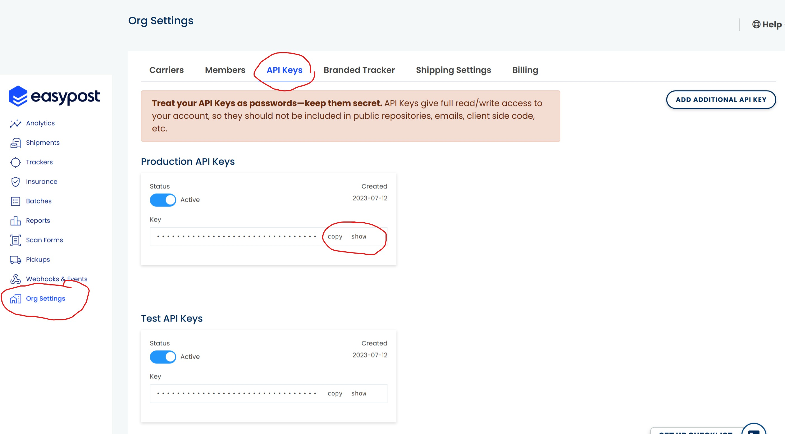

# EasyPost API Key Setup

## Prerequisites

Ensure you have Python, Node.js and angular cli tools installed on your system.

## Obtaining EasyPost API Key

- Visit https://www.easypost.com/ and register for an account.
- Once registered, log in to your EasyPost account to access the dashboard.
  In the dashboard, you will find your EasyPost API key. This API key will be required for the backend server to interact with EasyPost services.
  

## Starting the Backend Server

### Install Dependencies

- Open a terminal or command prompt.
- Navigate to the "backend" folder for the project.
- Run the following command to install the required Python dependencies:

```bash
pip install flask requests flask-cors easypost
```

### Setup EasyPost API Key in Backend

- Open the "backend/app.py" file in a code editor.
  Look for the line that starts with EASYPOST_API_KEY = and replace YOUR_EASYPOST_API_KEY with the API key you obtained from EasyPost.
- Save the changes to the file.

### Run the Backend Server

- In the terminal or command prompt, make sure you are in the "backend" folder of your project.
  Run the following command to start the backend server:

```bash
python app.py
```

- The backend server should now be running on http://127.0.0.1:5000.

## Starting the React App

### Install Dependencies

- Open a new terminal or command prompt.
- Navigate to the "frontend-react" folder of your project.
- Run the following command to install the required Node.js dependencies:

```bash
npm install
```

### Run the React App

- In the same terminal or command prompt, make sure you are in the "frontend-react" folder of your project.
  Run the following command to start the React app:

```bash
npm start
```

- The React app should now be running on http://localhost:3000.

## Starting the Angular App

#### Install Dependencies

- Open a new terminal or command prompt.
- Navigate to the "frontend-angular" folder of your project.
- Run the following command to install the required Node.js dependencies:

```bash
 npm install
```

### Run the Angular App

- In the same terminal or command prompt, make sure you are in the "frontend-angular" folder of your project.
- Run the following command to start the Angular app:

```bash
ng serve
```

The Angular app should now be running on http://localhost:4200.
